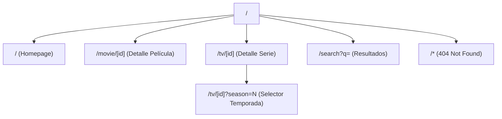

# UI Blueprint — Mapa Exhaustivo de Pantallas, Estados y Flujos

> Este documento es el **contrato visual y funcional definitivo** de la aplicación Cinema.
> Antes de escribir una sola línea de código, cada pantalla, cada estado de cada componente,
> cada notificación y cada error posible queda aquí catalogado.

---

## 1. Sitemap Completo (Todas las Rutas)



### Inventario de Archivos por Ruta

| Ruta                | `page.tsx` | `loading.tsx` | `error.tsx` | `not-found.tsx` | Layout propio                          |
| ------------------- | ---------- | ------------- | ----------- | --------------- | -------------------------------------- |
| `/` (Homepage)      | ✅         | ✅            | ✅          | —               | — (usa `(main)/layout.tsx`)            |
| `/movie/[id]`       | ✅         | ✅            | ✅          | ✅              | —                                      |
| `/tv/[id]`          | ✅         | ✅            | ✅          | ✅              | —                                      |
| `/search`           | ✅         | ✅            | ✅          | —               | —                                      |
| `(main)/layout.tsx` | —          | —             | —           | —               | ✅ (Header + Footer)                   |
| `app/layout.tsx`    | —          | —             | ✅ (global) | ✅ (global)     | ✅ (Root: fonts, theme, metadata base) |

---

## 2. Catálogo de Pantallas — Estado por Estado

### 2.1. Homepage (`/`)

#### Estados:

| Estado            | Condición                           | Qué se renderiza                                                                                                              |
| ----------------- | ----------------------------------- | ----------------------------------------------------------------------------------------------------------------------------- |
| **Loading**       | Fetch a TMDB en curso               | `loading.tsx`: Hero skeleton (`h-[60vh] animate-pulse bg-[#141420]`) + 3 filas de card skeletons (6 por fila)                 |
| **Success**       | TMDB responde correctamente         | Hero banner con película tendencia + Secciones: "Tendencias", "Estrenos", "Mejor Valoradas", "Continuar Viendo"               |
| **Error**         | TMDB devuelve 500 o timeout         | `error.tsx`: Mensaje centrado "No pudimos cargar el catálogo" + botón "Intentar de nuevo" (`reset()`)                         |
| **Partial Error** | Una sección falla, las demás cargan | Solo esa sección muestra mini-error inline. Las demás renderizan normal (cada sección envuelta en `<Suspense>` independiente) |

#### Componentes en esta pantalla:

| Componente            | Tipo       | Props/Datos                                                                    |
| --------------------- | ---------- | ------------------------------------------------------------------------------ |
| `HeroBanner`          | Server     | Película/Serie de tendencia #1 (backdrop, título, sinopsis truncada)           |
| `MediaRow`            | Server     | Título de sección + array de `MovieSummary \| TVShowSummary` + botón "Ver más" |
| `MediaCard`           | Server     | `id`, `title`, `poster_path`, `vote_average`, `media_type`, `release_date`     |
| `ContinueWatchingRow` | **Client** | Lee `localStorage` via `useWatchHistory()`. Renderiza cards del historial      |
| `SearchBar`           | **Client** | Input controlado con debounce. Navega a `/search?q=...`                        |

#### Sub-estados de `ContinueWatchingRow`:

| Estado                       | Condición                                 | Qué se renderiza                                                   |
| ---------------------------- | ----------------------------------------- | ------------------------------------------------------------------ |
| **Vacío (Empty)**            | `localStorage` sin historial o primer uso | Sección oculta completamente (no mostrar "Continuar Viendo" vacío) |
| **Con datos**                | Al menos 1 item en historial              | Fila horizontal scrollable de cards del historial, máximo 30       |
| **localStorage inaccesible** | Modo incógnito estricto o error           | Sección oculta (degradación silenciosa, `try/catch`)               |

---

### 2.2. Página de Detalle — Película (`/movie/[id]`)

#### Estados:

| Estado          | Condición                                    | Qué se renderiza                                                                                                             |
| --------------- | -------------------------------------------- | ---------------------------------------------------------------------------------------------------------------------------- |
| **Loading**     | Fetch del detalle de película en curso       | `loading.tsx`: Backdrop skeleton + poster skeleton lateral + líneas de texto skeleton                                        |
| **Success**     | TMDB responde correctamente con detalle      | Backdrop hero + Poster + Metadata (título, año, duración, géneros, rating) + Sinopsis + Cast + Reproductor + Recomendaciones |
| **Not Found**   | TMDB devuelve 404 para ese ID                | `not-found.tsx`: "Esta película no existe" + enlace a Homepage                                                               |
| **Error**       | TMDB devuelve 500 o network timeout          | `error.tsx`: "No pudimos cargar esta película" + botón "Intentar de nuevo"                                                   |
| **ID Inválido** | El parámetro `[id]` no es un entero positivo | `not-found.tsx`: Misma pantalla 404 (la validación lanza antes del fetch)                                                    |

#### Componentes en esta pantalla:

| Componente            | Tipo       | Props/Datos                                                                                                                |
| --------------------- | ---------- | -------------------------------------------------------------------------------------------------------------------------- |
| `MovieHero`           | Server     | `backdrop_path`, `title`, `tagline` con gradient overlay                                                                   |
| `MovieInfo`           | Server     | `title`, `release_date`, `runtime`, `genres[]`, `vote_average`, `overview`                                                 |
| `CastCarousel`        | Server     | Array de `CastMember[]` (scroll horizontal)                                                                                |
| `VideoPlayer`         | **Client** | Iframe con `src=vidsrc.to/embed/movie/{id}`. Monta en div `bg-black`                                                       |
| `WatchHistorySaver`   | **Client** | Componente invisible. En `useEffect`→ guarda en `localStorage` el `{tmdb_id, title, poster_path, type:'movie', timestamp}` |
| `RecommendationsGrid` | Server     | Array de `MovieSummary[]` de `/movie/{id}/recommendations`                                                                 |
| `ImageWithFallback`   | **Client** | Wrapper de `<Image>` con `onError` → muestra placeholder estilizado                                                        |
| `PlayerDisclaimer`    | **Client** | Texto de aviso sobre el reproductor externo (si sandbox relajado)                                                          |

#### Sub-estados del `VideoPlayer`:

| Estado      | Condición                       | Qué se renderiza                                                                                     |
| ----------- | ------------------------------- | ---------------------------------------------------------------------------------------------------- |
| **Loading** | Iframe cargando                 | Div `bg-black aspect-video` con spinner centrado o skeleton                                          |
| **Loaded**  | Iframe renderizado              | Iframe visible, controles del proveedor                                                              |
| **Blocked** | Navegador bloquea iframe (raro) | Mensaje: "Tu navegador bloqueó el reproductor. Desactiva tu bloqueador de anuncios para esta página" |

#### Sub-estados de `ImageWithFallback`:

| Estado         | Condición                                     | Qué se renderiza                                                      |
| -------------- | --------------------------------------------- | --------------------------------------------------------------------- |
| **Success**    | `poster_path` válido y carga correctamente    | `<Image>` normal con `object-cover`                                   |
| **No Path**    | `poster_path` es `null`                       | Placeholder: `bg-[#1c1c2e]` + ícono SVG de película + título centrado |
| **Load Error** | `poster_path` existe pero la URL devuelve 404 | Mismo placeholder que "No Path" (capturado via `onError`)             |

---

### 2.3. Página de Detalle — Serie de TV (`/tv/[id]`)

#### Estados:

Mismos que Película, más los siguientes adicionales por el selector de episodios:

| Estado                      | Condición                               | Qué se renderiza                                                                         |
| --------------------------- | --------------------------------------- | ---------------------------------------------------------------------------------------- |
| **Loading Temporada**       | Fetch de `/tv/{id}/season/{n}` en curso | Lista de episodios muestra skeletons (5 líneas `animate-pulse`)                          |
| **Success Temporada**       | Lista de episodios recibida             | Cards/filas de episodios con `episode_number`, `name`, `still_path`, `overview` truncado |
| **Error Temporada**         | Fetch de temporada falla                | Mensaje inline: "No pudimos cargar los episodios" + botón "Reintentar"                   |
| **Temporada sin episodios** | TMDB devuelve array vacío               | Mensaje: "No hay episodios disponibles para esta temporada"                              |

#### Componentes exclusivos de TV:

| Componente         | Tipo       | Props/Datos                                                                           |
| ------------------ | ---------- | ------------------------------------------------------------------------------------- |
| `SeasonSelector`   | **Client** | Dropdown `<select>` con `seasons[]`. Al cambiar, dispara fetch de episodios           |
| `EpisodeList`      | **Client** | Lista de `Episode[]` para la temporada seleccionada                                   |
| `EpisodeCard`      | **Client** | `episode_number`, `name`, `still_path`, `runtime`. Click → actualiza `src` del iframe |
| `VideoPlayer` (TV) | **Client** | Iframe con `src=vidsrc.to/embed/tv/{id}/{season}/{episode}`. Cambia dinámicamente     |

---

### 2.4. Página de Búsqueda (`/search?q=...`)

#### Estados:

| Estado                             | Condición                            | Qué se renderiza                                                                                          |
| ---------------------------------- | ------------------------------------ | --------------------------------------------------------------------------------------------------------- |
| **Initial (sin query)**            | URL es `/search` sin parámetro `q`   | Página con solo SearchBar arriba y mensaje: "Escribe el nombre de una película o serie para buscar"       |
| **Loading**                        | Fetch de `/search/multi` en curso    | `loading.tsx`: Grid de card skeletons debajo del SearchBar                                                |
| **Success con resultados**         | TMDB devuelve `results.length > 0`   | Grid de `MediaCard` (películas y series mezcladas). Personas filtradas (no mostramos personas en la grid) |
| **Success sin resultados (Empty)** | TMDB devuelve `results.length === 0` | Empty State: Ícono SVG de lupa + "No encontramos resultados para '{query}'" + "Prueba con otro término"   |
| **Error**                          | TMDB devuelve error                  | `error.tsx`: "La búsqueda falló" + botón reintentar                                                       |
| **Carga de más resultados**        | Usuario pulsa "Cargar más"           | 3 card skeletons extra al final + fetch de `page + 1`. El botón se desactiva durante el fetch             |
| **Fin de resultados**              | `page >= total_pages`                | El botón "Cargar más" desaparece                                                                          |

#### Componentes en esta pantalla:

| Componente          | Tipo          | Props/Datos                                                                |
| ------------------- | ------------- | -------------------------------------------------------------------------- |
| `SearchBar`         | **Client**    | Input con debounce (300ms). Actualiza URL con `router.push(/search?q=...)` |
| `SearchResultsGrid` | Server/Client | Grid responsive de `MediaCard`. Recibe `query` y `page` como props         |
| `LoadMoreButton`    | **Client**    | Botón que incrementa `page` y hace fetch via Server Action                 |
| `EmptySearchState`  | Server        | Ilustración SVG + texto informativo                                        |
| `SearchResultCount` | Server        | Badge: "42 resultados para 'batman'"                                       |

---

### 2.5. Página 404 Global (`not-found.tsx`)

| Qué se renderiza                                                    |
| ------------------------------------------------------------------- |
| Ilustración SVG cinematográfica (cinta de película rota o claqueta) |
| Título: "404 — Escena no encontrada"                                |
| Subtítulo: "La página que buscas no existe o fue eliminada"         |
| Botón CTA: "Volver al inicio" → navega a `/`                        |

---

### 2.6. Página de Error Global (`error.tsx`)

| Qué se renderiza                                                            |
| --------------------------------------------------------------------------- |
| Ícono SVG de advertencia                                                    |
| Título: "Algo salió mal"                                                    |
| Subtítulo: "Se produjo un error inesperado. Por favor, inténtalo de nuevo." |
| Botón primario: "Intentar de nuevo" → `reset()`                             |
| Botón secundario: "Ir al inicio" → navega a `/`                             |

---

## 3. Componentes Compartidos (UI Global)

### 3.1. Header / Navbar

| Elemento                | Comportamiento                                                                                                      |
| ----------------------- | ------------------------------------------------------------------------------------------------------------------- |
| **Logo**                | Enlace a `/`. SVG o texto estilizado "Cinema"                                                                       |
| **NavLinks**            | "Películas", "Series", "Búsqueda". Resalto visual en la ruta activa (`font-semibold text-white` vs `text-gray-400`) |
| **SearchIcon (mobile)** | En pantallas `< md`: Solo ícono de lupa. Click → navega a `/search`                                                 |
| **SearchBar (desktop)** | En pantallas `>= md`: Input inline compacto en la navbar                                                            |
| **Scroll behavior**     | Transparente en top → `bg-[#0a0a0f]/90 backdrop-blur-md` al hacer scroll (transición `transition-all duration-300`) |

#### Estados del Header:

| Estado       | Condición       | Apariencia                                         |
| ------------ | --------------- | -------------------------------------------------- |
| **Top**      | `scrollY === 0` | Fondo transparente, se funde con el Hero           |
| **Scrolled** | `scrollY > 50`  | Fondo `bg-[#0a0a0f]/90 backdrop-blur-md shadow-lg` |

### 3.2. Footer

| Elemento       | Contenido                                                                                                                                       |
| -------------- | ----------------------------------------------------------------------------------------------------------------------------------------------- |
| **Disclaimer** | "Cinema no aloja ni almacena contenido. Todos los datos del catálogo provienen de TMDB. La reproducción es proporcionada por fuentes externas." |
| **Links**      | "TMDB", "GitHub" (si el proyecto es open source)                                                                                                |
| **Copyright**  | "© 2026 Cinema"                                                                                                                                 |

### 3.3. MediaCard (Reutilizable)

Usado en: Homepage, Search, Recommendations.

| Estado            | Condición                           | Apariencia                                                                                |
| ----------------- | ----------------------------------- | ----------------------------------------------------------------------------------------- |
| **Default**       | Renderizado normal                  | Poster + título truncado + año + rating star                                              |
| **Hover**         | Mouse/touch sobre la card           | `scale-105 shadow-xl shadow-indigo-500/10` + badge de tipo ("Película" o "Serie") visible |
| **Focus**         | Navegación por teclado              | `ring-2 ring-indigo-500 outline-none`                                                     |
| **Image Loading** | Poster cargando (Next.js `<Image>`) | Skeleton `animate-pulse bg-[#1c1c2e]` con `aspect-[2/3]`                                  |
| **Image Error**   | Poster no disponible o 404          | Fallback: fondo sólido + ícono de película + título                                       |

### 3.4. Skeleton Components

| Skeleton             | Usado en                                  | Forma                                                                                                      |
| -------------------- | ----------------------------------------- | ---------------------------------------------------------------------------------------------------------- |
| `HeroSkeleton`       | Homepage loading                          | `h-[60vh] w-full rounded-none animate-pulse bg-[#141420]`                                                  |
| `CardSkeleton`       | Grids loading                             | `aspect-[2/3] rounded-lg animate-pulse bg-[#141420]` + `h-4 w-3/4 mt-2 rounded` + `h-3 w-1/2 mt-1 rounded` |
| `DetailSkeleton`     | Movie/TV loading                          | Backdrop skeleton + poster sidebar + 5 líneas de texto de diferentes anchos                                |
| `EpisodeRowSkeleton` | Season loading                            | `h-16 w-full rounded-lg animate-pulse bg-[#141420]` × 5                                                    |
| `SearchBarSkeleton`  | — (no usado, SearchBar es client directo) | —                                                                                                          |

---

## 4. Catálogo de Notificaciones y Feedback al Usuario

> [!NOTE]
> En la fase MVP, la app **no usa un sistema de toasts/snackbars**. Todo el feedback visual se gestiona
> mediante estados de los propios componentes (inline) y error boundaries de Next.js.
> Si en futuras iteraciones se añaden funcionalidades como "Favoritos" o "Listas", se implementará un Toast system.

### 4.1. Feedback Inline (Dentro de componentes)

| Acción del usuario         | Feedback visual                                                                                   | Componente                    |
| -------------------------- | ------------------------------------------------------------------------------------------------- | ----------------------------- |
| Buscar sin escribir nada   | Placeholder: "Escribe el nombre de una película o serie..."                                       | `SearchBar`                   |
| Buscar y no hay resultados | Empty State SVG + texto                                                                           | `EmptySearchState`            |
| Click en "Cargar más"      | Botón cambia a estado disabled + spinner SVG inline                                               | `LoadMoreButton`              |
| Cambiar de temporada       | Lista de episodios muestra skeletons mientras carga                                               | `EpisodeList`                 |
| Click en episodio          | Episodio seleccionado resaltado (`bg-indigo-500/20 border-l-2 border-indigo-500`). Iframe recarga | `EpisodeCard` + `VideoPlayer` |
| Visitar `/movie/[id]`      | Guardado automático silencioso en localStorage (sin feedback visual al usuario)                   | `WatchHistorySaver`           |

### 4.2. Feedback de Error (Error Boundaries)

| Contexto                     | Mensaje                                                                                                    | Acción disponible                      |
| ---------------------------- | ---------------------------------------------------------------------------------------------------------- | -------------------------------------- |
| Homepage no carga            | "No pudimos cargar el catálogo. Esto puede deberse a un problema temporal con nuestro proveedor de datos." | `[Intentar de nuevo]`                  |
| Detalle de película no carga | "No pudimos cargar la información de esta película."                                                       | `[Intentar de nuevo]` `[Ir al inicio]` |
| Detalle de serie no carga    | "No pudimos cargar la información de esta serie."                                                          | `[Intentar de nuevo]` `[Ir al inicio]` |
| Busqueda falla               | "La búsqueda no pudo completarse."                                                                         | `[Intentar de nuevo]`                  |
| Película no existe (404)     | "Esta película no existe o fue eliminada de nuestro catálogo."                                             | `[Volver al inicio]`                   |
| Serie no existe (404)        | "Esta serie no existe o fue eliminada de nuestro catálogo."                                                | `[Volver al inicio]`                   |
| Ruta no existe (404 global)  | "404 — Escena no encontrada"                                                                               | `[Volver al inicio]`                   |
| Error inesperado (global)    | "Algo salió mal. Se produjo un error inesperado."                                                          | `[Intentar de nuevo]` `[Ir al inicio]` |

### 4.3. Disclaimer del Reproductor

| Condición                              | Mensaje                                                                                                                          | Ubicación                                      |
| -------------------------------------- | -------------------------------------------------------------------------------------------------------------------------------- | ---------------------------------------------- |
| Sandbox relajado (allow-popups activo) | "⚠️ Este reproductor externo puede mostrar ventanas emergentes. Recomendamos usar un bloqueador de anuncios como uBlock Origin." | Debajo del iframe, `text-xs text-amber-400/80` |
| Siempre visible                        | "El contenido es proporcionado por fuentes externas. Cinema no aloja ni controla el reproductor."                                | Debajo del iframe, `text-xs text-gray-500`     |

---

## 5. Flujos de Navegación Completos

### 5.1. Flujo Principal: Descubrir → Ver

```
[Homepage] → Click en MediaCard → [/movie/123 o /tv/456]
                                        │
                                        ├→ Se guarda en localStorage automáticamente
                                        ├→ Scroll down → Ve reproductor
                                        └→ Scroll más → Ve recomendaciones
                                              │
                                              └→ Click en recomendación → [/movie/789]
```

### 5.2. Flujo de Búsqueda

```
[Cualquier página] → Click SearchBar/Ícono → [/search]
    │
    ├→ Escribe "Batman" → debounce 300ms → URL: /search?q=batman
    │     │
    │     ├→ Resultados → Grid de cards → Click → [/movie/id]
    │     ├→ Sin resultados → Empty State
    │     └→ Error → error.tsx con retry
    │
    └→ Borra el texto → Vuelve a estado Initial
```

### 5.3. Flujo de Series (Temporada/Episodio)

```
[/tv/456] → Carga detalle de serie
    │
    ├→ Sección "Temporadas y Episodios"
    │     │
    │     ├→ Dropdown con temporadas (S1 seleccionada por defecto)
    │     │     │
    │     │     └→ Cambia a S2 → Loading episodios → Lista de episodios S2
    │     │
    │     └→ Click en Episodio 3 → Iframe src cambia a /embed/tv/456/2/3
    │           │
    │           └→ Episodio 3 queda resaltado visualmente
    │
    └→ Reproductor arriba muestra el episodio seleccionado
```

### 5.4. Flujo de "Continuar Viendo"

```
[/movie/123] → useEffect guarda {tmdb_id:123, title:"...", poster_path:"...", type:"movie", timestamp:...}
    │
    └→ Usuario vuelve a [Homepage]
          │
          └→ Sección "Continuar Viendo" aparece (antes no existía si localStorage vacío)
                │
                └→ Click en card del historial → [/movie/123]
```

### 5.5. Flujo de Error y Recuperación

```
[Homepage] → TMDB devuelve 500
    │
    └→ error.tsx renderiza
          │
          ├→ Click "Intentar de nuevo" → reset() → Re-render → TMDB OK → Homepage normal
          │
          └→ Click "Ir al inicio" → router.push("/") → Mismo efecto
```

---

## 6. Accesibilidad — Mapa de Interacciones de Teclado

| Contexto            | Tecla         | Acción                                      |
| ------------------- | ------------- | ------------------------------------------- |
| NavBar              | `Tab`         | Navega entre Logo → Links → SearchBar       |
| MediaCard Grid      | `Tab`         | Navega entre cards                          |
| MediaCard           | `Enter`       | Navega a la página de detalle               |
| SearchBar           | `Enter`       | Ejecuta búsqueda (navega a `/search?q=...`) |
| SearchBar           | `Escape`      | Limpia el input                             |
| Season Dropdown     | `↑/↓`         | Navega entre opciones                       |
| Season Dropdown     | `Enter`       | Selecciona temporada                        |
| Episode List        | `Tab`         | Navega entre episodios                      |
| Episode Card        | `Enter`       | Selecciona episodio para reproducir         |
| Error Button        | `Enter/Space` | Ejecuta la acción del botón                 |
| "Cargar más" Button | `Enter/Space` | Carga siguiente página                      |

---

## 7. Responsive — Comportamiento por Breakpoint

### Homepage

| Elemento         | Mobile (`< 640px`)                    | Tablet (`640-1024px`)        | Desktop (`> 1024px`)               |
| ---------------- | ------------------------------------- | ---------------------------- | ---------------------------------- |
| Hero Banner      | `h-[50vh]` título `text-2xl`          | `h-[60vh]` título `text-3xl` | `h-[80vh]` título `text-5xl`       |
| Media Grid       | `grid-cols-2 gap-3`                   | `grid-cols-3 gap-4`          | `grid-cols-5 xl:grid-cols-6 gap-5` |
| SearchBar        | Oculto → Solo ícono de lupa           | Ícono que expande a input    | Input siempre visible en navbar    |
| Continuar Viendo | Scroll horizontal (`overflow-x-auto`) | Igual                        | Igual con cards más grandes        |
| Footer           | Stack vertical, centrado              | Horizontal, espaciado        | Horizontal, max-width `1280px`     |

### Página de Detalle

| Elemento             | Mobile                                            | Tablet                     | Desktop                                                          |
| -------------------- | ------------------------------------------------- | -------------------------- | ---------------------------------------------------------------- |
| Layout general       | Stack vertical: Backdrop → Info → Player → Recs   | Igual con más padding      | Poster lateral (`w-64`) + Info derecha. Player full width debajo |
| Poster               | Oculto o `w-32` centrado sobre el backdrop        | `w-48` lateral             | `w-64` lateral sticky                                            |
| Reproductor          | `aspect-video w-full px-2`                        | `aspect-video w-full px-4` | `max-w-5xl mx-auto aspect-video`                                 |
| Cast                 | Scroll horizontal `overflow-x-auto`, fotos `w-16` | Fotos `w-20`               | Fotos `w-24`                                                     |
| Recomendaciones      | `grid-cols-2`                                     | `grid-cols-3`              | `grid-cols-5`                                                    |
| Season Selector (TV) | Dropdown full width                               | Dropdown `w-48`            | Dropdown `w-56`                                                  |
| Episode List (TV)    | Stack vertical, cards compactas                   | 2 columnas                 | 3 columnas                                                       |

### Página de Búsqueda

| Elemento     | Mobile                 | Desktop                      |
| ------------ | ---------------------- | ---------------------------- |
| SearchBar    | Full width con padding | `max-w-2xl mx-auto`          |
| Results Grid | `grid-cols-2`          | `grid-cols-4 lg:grid-cols-5` |
| "Cargar más" | Full width button      | `w-auto mx-auto`             |

---

## 8. Rendimiento — Estrategia de Carga

| Recurso               | Estrategia                               | Implementación                                                             |
| --------------------- | ---------------------------------------- | -------------------------------------------------------------------------- |
| Imágenes de Poster    | Lazy loading nativo de Next.js `<Image>` | `loading="lazy"` (default), `priority` solo en Hero                        |
| Imágenes del Hero     | **Eager loading** (above the fold)       | `priority={true}` en `<Image>`                                             |
| Iframe VidSrc         | Lazy loading                             | `loading="lazy"` en el `<iframe>`                                          |
| Secciones de Homepage | Streaming SSR con `<Suspense>`           | Cada `<MediaRow>` en su propio `<Suspense fallback={<CardSkeletonRow />}>` |
| Recomendaciones       | Lazy después del contenido principal     | Envuelto en `<Suspense>` independiente                                     |
| Cast Carousel         | Parte del fetch principal de detalle     | Incluido en el mismo `fetch` de `/movie/{id}?append_to_response=credits`   |
